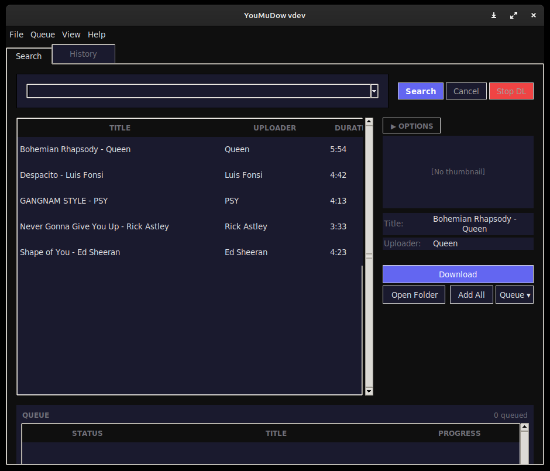
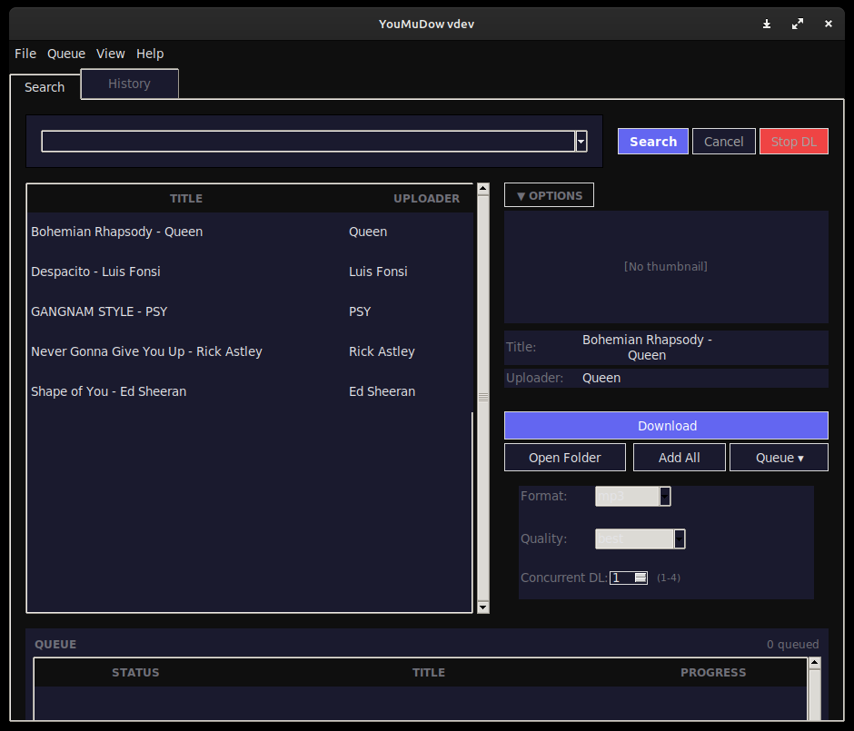
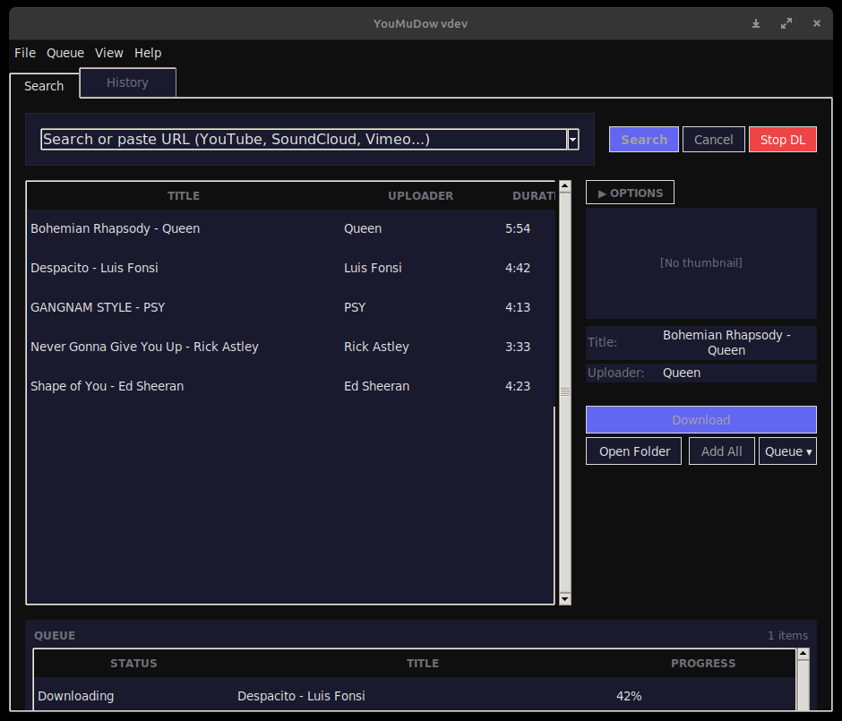

# YouMuDow


[](https://github.com/Ghostalex07/YouMuDow/actions/workflows/ci.yml)

A modern music & video downloader with real-time progress, embedded metadata, and a clean desktop interface.

## Screenshots

| Main window | Configuration panel |
|---|---|
|  |  |

| Queue panel | Progress & log |
|---|---|
|  |  |

## Features

- **Multi-site support**: YouTube, SoundCloud, Vimeo, Twitter and 1000+ sites via yt-dlp
- **Multi-format downloads**: MP3, MP4, WAV, M4A, FLAC, AAC, OGG
- **Embedded metadata and thumbnails**: Title, artist, thumbnail automatically added to files
- **Real-time progress bar and download log**: See progress as it happens
- **Queue system with visible queue panel**: Manage queued, active, and completed downloads
- **Thumbnail preview in detail panel**: See video thumbnails using Pillow
- **Persistent configuration**: Remembers output folder, format, cookies, window geometry
- **System notifications on completion**: Desktop notification when download finishes
- **Light/Dark theme**: Toggle between light and dark themes (Ctrl+T)
- **Cookie authentication**: Chrome, Firefox, Edge, Brave, Opera, Vivaldi, multi-profile support
- **Rate limiting, chapter splitting, subtitle download**: Advanced download options
- **yt-dlp auto-updater built in**: Help > Update yt-dlp keeps it current
- **Export download logs to file**: File > Export Logs saves session logs
- **Retry failed downloads**: One-click retry for errored downloads
- **Clipboard URL detection on startup**: Automatically detects URLs in clipboard
- **Command-line interface**: `youmudow-cli` for headless downloads and searches
- **Cross-platform**: Linux, macOS, Windows
- **Keyboard shortcuts**: Ctrl+D to download, Ctrl+Q to queue, and more

## Requirements

- Python 3.10+
- ffmpeg (required by yt-dlp)
- tkinter (included with Python on Windows/macOS; needs separate install on Linux)

## Installation

### Option 1: Run from source

```bash
git clone https://github.com/Ghostalex07/YouMuDow.git
cd YouMuDow
python3 -m venv .venv && source .venv/bin/activate   # optional but recommended
pip install -e .
youmudow
```

Linux users also need the Tkinter bindings (included with Python on Windows/macOS):

```bash
sudo apt install python3-tk    # Debian/Ubuntu
sudo dnf install python3-tkinter   # Fedora
```

### Option 2: Download executable

Download the latest release from the [Releases page](https://github.com/Ghostalex07/YouMuDow/releases).
ffmpeg must still be installed separately.

## ffmpeg Installation

### Linux

```bash
sudo apt install ffmpeg       # Debian/Ubuntu
sudo dnf install ffmpeg       # Fedora
```

### macOS

```bash
brew install ffmpeg
```

### Windows

Download from [ffmpeg.org](https://ffmpeg.org/download.html) and add to PATH.

## Usage

1. **Search**: Enter a song name or paste a URL (YouTube, SoundCloud, etc.)
2. **Select**: Click on a result
3. **Choose format**: Select MP3, MP4, WAV, or M4A
4. **Download options** (optional):
   - **Cookies**: Enable and select browser or import cookies file
   - **Rate limit**: Limit download speed (e.g., `1M`, `500K`)
   - **Split chapters**: Split video into separate files per chapter
   - **Subtitles**: Download and embed subtitles
5. **Download**: Click Download or add to queue
6. **Monitor**: Watch progress in the queue panel and status bar

## Command-Line Interface

YouMuDow ships with `youmudow-cli`, a headless CLI that reuses the exact same
services as the desktop app (no duplicate download or search logic):

```bash
# Download a video as MP3
youmudow-cli download "https://www.youtube.com/watch?v=dQw4w9WgXcQ" --format mp3

# Search by query and download the best audio
youmudow-cli download "bohemian rhapsody" --format mp3 --quality 320kbps

# Download to a specific folder without resolving metadata
youmudow-cli download "https://..." --output ~/Downloads --skip-metadata

# Search without downloading
youmudow-cli search "lofi beats" --limit 10
```

`download` options: `--format` (mp3, m4a, flac, wav, ogg, opus, aac, mp4, ...),
`--quality` (bitrate or resolution), `--output DIR`, `--skip-metadata`.
`search` options: `--limit N` (default 10). Run `youmudow-cli --version` for the version.

## Keyboard Shortcuts

| Shortcut | Action |
|----------|--------|
| `Ctrl+Enter` | Search |
| `Ctrl+D` | Download selected |
| `Ctrl+Q` | Add to queue |
| `Ctrl+L` | Focus search field |
| `Ctrl+N` | Clear search field |
| `Escape` | Cancel operation |
| `Ctrl+V` | Paste URL (auto-replaces field) |
| `Ctrl+T` | Toggle light/dark theme |

## Architecture

YouMuDow follows a strict layered architecture — see
[docs/architecture.md](docs/architecture.md) for the full diagram and dependency
rules:

```
ui → app → services → domain
      ↘   ↗        ↘
     adapters        adapters
```

- `domain/` — data models, validators, exceptions (stdlib only)
- `adapters/` — yt-dlp subprocess wrapper, browser profile detection
- `services/` — download, search, history, thumbnail, notification logic
- `app/` — controller, state, configuration
- `ui/` — Tkinter interface (window, styles, widgets)

## Building from source

```bash
pip install pyinstaller
python scripts/build.py       # generates executable in dist/
python scripts/package.py     # generates distributable ZIP
```

## Development

```bash
make install                 # pip install -e ".[dev]" (pinned tooling)
make run                     # launch the desktop app
make test                    # run the test suite
make coverage                # run tests with coverage report
make lint                    # ruff lint (read-only)
make format                  # auto-format code
make typecheck               # mypy
make check                   # run every quality gate (lint + format + mypy + tests)
```

Without `make`, the same commands are:

```bash
pip install -e ".[dev]"                     # installs pinned dev tooling
PYTHONPATH=src python3 -m pytest            # tests
PYTHONPATH=src python3 -m pytest --cov      # tests with coverage report
ruff check src/ tests/                      # lint
ruff format --check src/ tests/             # formatting
PYTHONPATH=src mypy                         # type checking
```

Pre-commit hooks are configured via `.pre-commit-config.yaml`:

```bash
pip install pre-commit && pre-commit install
```

All checks above are enforced by CI. The coverage gate (`fail_under` in
`pyproject.toml`) is currently **70%**; UI smoke tests
(`tests/unit/test_window_smoke.py`) need a display server and run under
`xvfb-run` in CI.

## Project Structure

```
youmudow/
├── src/youmudow/
│   ├── __init__.py            # App version (from package metadata)
│   ├── main.py                # Entry point
│   ├── cli.py                 # youmudow-cli entry point
│   ├── logging_config.py      # Centralized logging setup
│   ├── paths.py               # Shared config path resolution
│   ├── domain/                # Data models, validators, exceptions
│   ├── adapters/              # yt-dlp subprocess wrapper, browser profiles
│   ├── services/              # Download, search, history, thumbnail, notification
│   ├── app/                   # Controller, state, config
│   └── ui/                    # Tkinter interface (window, styles, widgets)
├── tests/
│   └── unit/
├── scripts/
│   ├── build.py               # PyInstaller build
│   ├── package.py             # Distribution packaging
│   └── bump_version.py        # Automated version bump
├── docs/
│   ├── architecture.md        # Layered architecture + dependency rules
│   ├── usage.md
│   ├── contributing.md
│   └── screenshots/
├── .github/workflows/
│   ├── ci.yml                 # CI pipeline (lint, typecheck, test, build)
│   └── release.yml            # Automated release
├── Makefile                   # Dev task shortcuts
├── .pre-commit-config.yaml
├── CHANGELOG.md
├── README.md
└── pyproject.toml
```

## License

MIT License - See [LICENSE](LICENSE) for details.
